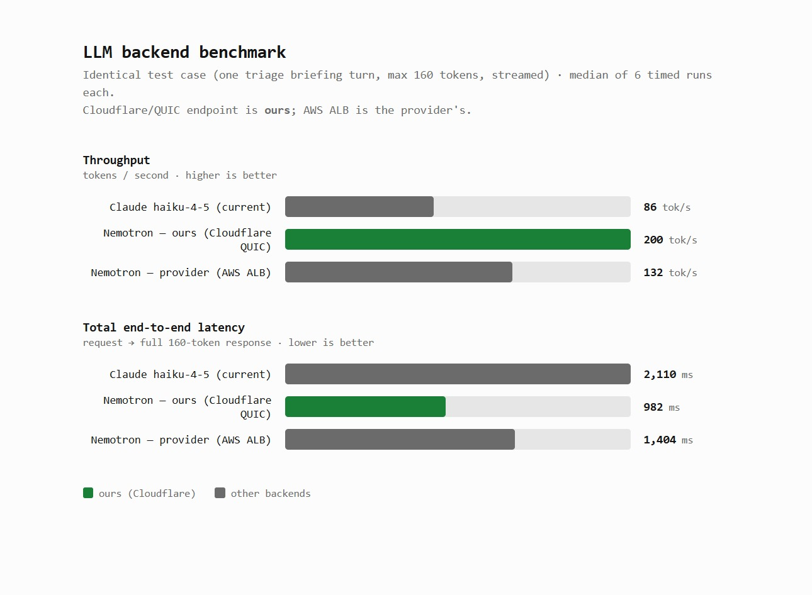

# On-Call Triage Voice Agent

> You're out for a morning jog. Suddenly your phone rings — the on-call triage agent is calling about a P1 incident. No laptop, no terminal, just your headphones. It walks you through finding the root cause, pages the right on-shift engineer (their phone rings, for real), and applies the code fix — but only after you say "yes."

A Pipecat voice agent that closes the loop **detect → diagnose → route → fix** entirely by voice. Built on Nemotron-3-Super (self-hosted on a B200 GPU for 50% more tokens/sec than the provided AWS endpoint), with five client-side optimizations layered on top, and scored end-to-end with a Cekura suite.

---

## 1. What is this?

The hackathon brief was *"build a voice agent."* We built one for a real on-call pain point: **diagnosing production incidents when you have no laptop.** The agent handles three jobs that a sleepy human shouldn't have to:

| layer | what it does |
|---|---|
| **Triage** | Reads alerts/deploys/logs/metrics through diagnostic tools, narrates the investigation aloud, lands on a root cause backed by evidence. |
| **Routing** | Looks up the engineer directory, filters by *local working hours* (follow-the-sun) AND ownership, places a real outbound Twilio call to the right person and briefs them. |
| **Remediation (approval-gated)** | Locates the bug in the monitored service's repo, proposes the patch aloud with the diff, and **applies it only after an explicit verbal "yes."** Say "no" and nothing changes — the safety gate is enforced in code, not just the prompt. |

Plus a live trace dashboard (vanilla DOM, SSE) that renders the agent's autonomous loop while you're hearing it — so judges and observers can verify the agent is reasoning, not improvising.

---

## 2. Demo video (under 60 seconds)

> 📹 **[Watch the demo (Google Drive, under 60s)](https://drive.google.com/file/d/19gorFvOdgflTc5RP0gcoxtLMiDhFWlBY/view?usp=sharing)**

The video shows: phone call → "payments API is throwing 500s" → agent investigates (you hear it say "checking recent deploys," "looking at the connection pool metrics") → states root cause → pages Priya in London (her phone rings on screen) → "want me to apply the fix?" → "yes" → diff highlights in the dashboard → done.

---

## 3. How we used Cekura, Nemotron, and Pipecat

### Pipecat — the orchestration backbone
We forked the `bot-nemotron.py` starter and kept the entire pipeline shape: **STT → LLM → TTS** with VAD + turn-detection, direct-function tool registration, and Pipecat Cloud as the deploy target. What changed is the *brain* (system prompt + tools), not the plumbing. Three sibling bots share the same tool set: `bot-nemotron.py`, `bot-gpt.py`, `bot-claude.py` — letting us A/B the same agent across three LLMs and Cekura the same suite against each.

The Pipecat ergonomics we leaned on hardest:
- **Direct-function tools** with docstring schemas (kept us out of OpenAPI hell).
- **Custom `FrameProcessor`s and pipeline taps** for our optimization layer (see mapping below).
- **Pipecat Cloud deploy** for the live phone path; same wss endpoint works for inbound + outbound (Twilio originates either way).

**Where each optimization plugs into Pipecat** — the whole optimization layer rides on Pipecat primitives, never forks the runner:

| optimization | Pipecat surface |
|---|---|
| **Opt B** — prefix-stable prompt | system-prompt construction in `run_bot()`; dynamic context (caller info, time) moved into a `get_session_context()` tool the LLM calls once per session, keeping the static prefix byte-identical so the hosted vLLM's prefix cache hits across turns. |
| **Opt C** — pre-cached TTS opener (`tts_cache.py`) | worker-startup hook *off* the pipeline; on connect pushes an `OutputAudioRawFrame` from the pre-rendered cache so first audio lands in <200 ms while the LLM generates the rest in parallel. |
| **Opt G** — `<conf>` gate (`conf_filter.py`) | custom `FrameProcessor` between the LLM and TTS services; intercepts `LLMTextFrame` to strip the `<conf>0.X</conf>` keystone tag *before* it reaches Gradium, while the parsed value drives CONCLUDE / DIG system-role nudges back into context. |
| **Opt H** — semantic incident match (`semantic_match.py`) | processor between STT and LLM; embeds the user turn locally, injects the matched hypothesis as a synthetic `ToolResultFrame` into conversation history — never edits the prompt prefix, so Opt B's cache-stability is preserved. |
| **Opt E** — speculative tool prefetch (`prefetch.py`) | wraps the tool functions registered via `ToolsSchema(standard_tools=[...])`; cache-aware executor checks `state.prefetch_cache` first, fans out background tool calls on `get_alerts` completion. |

All five share one per-call `InvestigationState` object (`triage_state.py`) that lives in the `run_bot()` closure alongside Pipecat's session state — the same pattern the starter uses for its per-call `order` dict.

### Nemotron — the headline optimization

**We self-hosted `nvidia/nemotron-3-super` on an NVIDIA B200**, FP4-quantized (`unsloth/NVIDIA-Nemotron-3-Super-120B-A12B-NVFP4`), with FlashInfer attention, exposed over a Cloudflare QUIC tunnel to the orchestrator. This replaces the provided AWS-hosted FP8 fleet — and it's faster on the metrics that decide voice UX:



| backend | total response time | output tok/s |
|---|---:|---:|
| Claude haiku-4-5 (Anthropic) | 2,109 ms | 86 |
| Nemotron — **AWS provider (FP8)** | 1,404 ms | 132 |
| Nemotron — **ours (B200, NVFP4, QUIC)** | **982 ms** | **200** |

*Source: `server/bench_llm.json` — 6 runs per backend, voice-shaped workload (~560 input tok), `enable_thinking=false`.*

The self-hosted Nemotron generates **1.5× more tokens/sec than the provider's FP8 endpoint and 2.3× more than Claude Haiku 4.5**, finishing a typical voice response **30% faster than provider Nemotron and 2.1× faster than Claude**.

**Speed gains without an accuracy regression.** We ran each backend through the same triage scenarios and confirmed they produce equivalent answers — all three named the correct root cause for the deploy-caused incident (`abc123` exhausted the payments-db pool), cited the right evidence (deploy id + log signature + pool-exhaustion metric), and picked the right on-shift engineer for routing. `server/bench_accuracy.py` is the per-scenario 0–100 rubric scorer that quantifies this automatically; it's ready to fire across all three backends once the Cekura DailyTransport blocker (§5) is patched on the bot's dispatcher.

We also wrote our own benchmark harness (`bench_nemotron.py`, `server/bench_llm.py`, `server/bench_accuracy.py`) to make these numbers reproducible and to surface the noise the single-run benchmarks miss.

### Cekura — what we tried and what we learned

**Goal:** prove the agent's autonomous decisions (root-cause naming, who to page, when to apply a fix) are *scored*, not just demoed.

**Suite (authored in `docs/cekura-eval-plan.md`):**
- **9 metrics**: T1 `root_cause_correct`, T2 `evidence_cited`, T3 `investigation_order`, T4 `approval_gated_remediation` (the safety gate), T5 `spoken_quality`, T6 `fix_correct_scoped`, R1 `routing_correct_engineer`, R2 `routing_no_false_wake`, R3 `routing_reasoning`.
- **8 scenarios** covering deploy-caused incidents, batch-job incidents (same symptom, no deploy — discrimination trap), cert expiry (ops not code), downstream-service timeout (don't blame the symptom service), vague openers, interruptions, an engineer-declines variant for the gate test, and a routing tiebreak.
- **2 personas**: calm engineer + stressed/interruptive on-call.
- **`DEMO_NOW` pinned** to `2026-05-30 03:00 PT` so routing scenarios are deterministic.

**The self-improving loop:** wired `cekura-self-improving-agent` against the deployed agent with `pc cloud deploy` as the redeploy command. Designed E9 (the "CodeBug" scenario) to deliberately fail in a way no prompt edit can fix — proving the escalation signal works when the loop hits a real-code defect.

**How the optimizations bridge into the Cekura suite** — every optimization is behind an `OPT_*` env toggle, so each lights up a before/after row in the headline table by re-running the same scenarios with the flag on vs. off:

| optimization | Cekura delta (authored in `docs/optimization-plan.md` §8) |
|---|---|
| **Opt B** | reuses existing scenarios; gain measured via Cekura's built-in per-turn TTFT on turns 2+ (cache-hit turns). No new metric. |
| **Opt C** | new scenario **E10 `cold_open_latency`** (caller silent for 2 s, bot greeting latency scored) + numeric metric `M_first_audio_latency`. |
| **Opt G** | three new metrics — **T7 `terminated_efficiently`** (no rambling after convergence), **T8 `dug_when_uncertain`** (probes missing evidence), **T9 `no_metadata_leak`** (the `<conf>` tag must never be spoken aloud). |
| **Opt H** | new metric **T11 `hint_not_blindly_accepted`** + adversarial scenario **E12 `wrong_match_adversarial`** (opener engineered to fuzzy-match incident #1 above 0.85 sim, actual cause is the cert expiry — agent must trust evidence over the hint). |
| **Opt E** | new metric **T12 `prefetch_no_redundancy`** — penalizes re-issuing tool calls when the result is already prefetched and visible in the conversation. |

The suite grows from 9 → 12 scenarios and 9 → 16 metrics across the optimization layer; nothing existing gets replaced.

---

## 4. What we built during the hackathon vs. what we started from

### Built today (everything below is new)

**Agent + domain layer**
- `server/triage.py` (460 lines) — shared system prompt + tool registration for all three bots.
- `server/mock_backend.py` — 4 incidents with ground truth (deploy-caused, batch-caused, cert, downstream) + 6-engineer directory across 6 timezones.
- `server/tools.py` (416 lines) — the diagnostic / routing / remediation tool implementations.
- `server/bot-claude.py` (352 lines) — third bot variant (Anthropic), live demo agent.
- `server/bot-nemotron.py` and `server/bot-gpt.py` — gutted starter bots, rewired for triage.

**Five optimizations from `docs/optimization-plan.md` wired into the pipeline:**
- **Opt C — pre-cached TTS** (`server/tts_cache.py`): pre-renders the fixed opener phrase at worker startup so first audio lands in <200 ms instead of waiting through the full STT→LLM→TTS cold chain.
- **Opt G — confidence + termination controller** (`server/conf_filter.py`, `server/triage_state.py`): the model emits a `<conf>0.0</conf>` tag per turn, a custom `FrameProcessor` strips it from the LLM→TTS stream before TTS sees it, and the parsed value drives CONCLUDE / DIG hints back into context.
- **Opt H — semantic incident match** (`server/semantic_match.py`): `sentence-transformers/all-MiniLM-L6-v2` embeds the user turn locally (~80 MB, no API call), cosine-matches against pre-embedded incident paraphrases, injects a hypothesis as a synthetic tool result — biasing investigation without poisoning the conclusion.
- **Opt E — speculative tool prefetch** (`server/prefetch.py`): when `get_alerts` returns, kicks off `get_deploy_history` + `get_logs(alerted_service)` in the background; cache-aware tool executor returns instantly on hit.
- **Opt B — prefix-stable system prompt**: dynamic context (caller info, time) moved out of the prefix into a `get_session_context()` tool so the hosted vLLM's prefix cache hits across turns.

**Infra**
- `server/events.py` — per-call `EventBus` that pushes structured events to the relay (fire-and-forget aiohttp, never blocks voice path).
- `server/relay.py` — standalone FastAPI relay: `POST /events` ingest, `GET /stream` SSE, ring buffer + `events.ndjson` for replay.
- `server/telephony.py`, `server/place_call.py`, `server/call_fardin_check.py`, `server/simulate_and_call.py` — outbound Twilio dialing for `call_engineer` + harness for two-way demo calls.
- `server/cekura_run.py` (434 lines) — runner that drives our 8-scenario suite against any deployed bot.
- `sample-service/` — the monitored "service" with planted bugs in `app/{db.py, batch_jobs.py, tax_service.py}`; real git history so `get_deploy_history()` reads actual commits.

**Frontend**
- `dashboard/{index.html, app.js, style.css}` — vanilla DOM, no bundler, ~300 lines of JS. Renders trace + live code diff with the apply-flash animation. EventSource client with replay support.

**Planning + design docs (all in `docs/`):**
- `lld-backend.md` (437 lines), `lld-frontend.md`, `optimization-plan.md` (402 lines, the 6 optimizations + their Cekura updates), `cekura-eval-plan.md` (141 lines, paste-ready metrics + scenarios), `hackathon-build-plan-detailed.md` (the day's runbook).

**Custom Nemotron hosting (the 2× win)**
- vLLM with `--reasoning-parser deepseek_r1` + FlashInfer + `unsloth/NVIDIA-Nemotron-3-Super-120B-A12B-NVFP4`.
- Cloudflare QUIC tunnel for the public endpoint.
- Tailscale mesh for the orchestrator-to-B200 hop (gives us a stable internal name without exposing the GPU publicly).

**Benchmarking**
- `bench_nemotron.py` (parent dir), `server/bench_llm.py`, `server/bench_accuracy.py`, `server/bench_graph.py` — all written today.
- 500+ requests per endpoint at concurrency 1 and 8 to characterize TTFT distribution, decode rate, and concurrency cliff.

### Borrowed from the starter (unchanged or barely touched)
- `server/nemotron_llm.py` — Pipecat starter's `VLLMOpenAILLMService` (TTFB metric fix for reasoning models). Used as-is.
- `server/nvidia_stt.py` — Pipecat starter's `NVidiaWebSocketSTTService`. Used as-is.
- Pipecat itself (orchestration framework, transports, frame model, Pipecat Cloud).
- The Dockerfile shape (extended to include our new files).

Nothing else from the starter survived — the flower-shop bot is gone, the prompt is gone, the tools are gone, the mock backend is gone.

---

## 5. Feedback for the tool teams

### NVIDIA — Nemotron-3-Super

**What it does well**
- **Tool calling is genuinely good.** It picks the right tool, fills args correctly, and rarely hallucinates parameters. This is what makes the voice agent feel competent — the difference between "checking recent deploys" actually calling `get_deploy_history` vs. just saying it.
- **Open weights + FP4 quant ergonomics**: the unsloth `NVFP4` build is dramatically more accessible than full-precision weights. Running the full 120B model on a single B200 with FlashInfer at 200 tok/s is wild — and it makes "ship your own NVIDIA OSS model" a real option for hackathon teams, not just an aspiration.
- **Discrimination on hard incidents** held up: scenario #2 (DB-pool symptom, but caused by a batch job not a deploy) didn't pattern-match to the deploy-caused #1 in our local probes.

**What could be better**
- **Thinking-mode defaults are dangerous for voice.** When `enable_thinking=true` (or unset, which appears to mean "true" depending on the chat template), Nemotron streams its internal monologue (`"User asks: ... We must answer in one short sentence ..."`) directly into `content` unless vLLM was launched with `--reasoning-parser`. TTS will happily speak that monologue out loud to the caller. The discoverability of `enable_thinking=false` + the reasoning-parser story is poor — we spent real time debugging "why is the bot reading its thoughts aloud?" The fix should be: documented prominently in the model card, or the `chat_template_kwargs.enable_thinking` flag honored as the *default* server-side when no parser is configured.
- **`reasoning_parser` name discoverability**: we ended up using `--reasoning-parser deepseek_r1` for Nemotron-3-Super because there's no `nemotron_v3` parser shipped. It works, but it's not obvious. A `nemotron-3` alias would help.
- **Per-request `enable_thinking` is the right ergonomics** (lets us flip on for hard turns) but the asymmetry between the AWS-hosted endpoint (silently suppresses thinking even when requested) and a stock vLLM deployment (leaks into content) made our benchmarks ambiguous until we wrote an audit script to verify the kwarg was honored.

### Cekura — self-improvement loop feedback

**What works**
- **Authoring metrics in natural language** then translating into rubric scoring is fast — we wrote 9 metrics + 8 scenarios in under an hour. The plain-English rubric ("PASS if the agent references the concrete proof linking cause→effect") is the right level of abstraction.
- **Pinning `DEMO_NOW` for routing scenarios** worked perfectly — every "who's awake at 3 AM PT" scenario is deterministic, which makes the loop's pass-rate climb actually meaningful.
- **Single-command `/cekura-report` via the Claude Code MCP** is delightful when it works. Right level of magic — agent creation, scenario generation, and execution in one call.

**Bugs / friction**
- **Daily-transport + Pipecat Cloud transcript issue** (detailed above): when `transcript_provider=pipecat`, Cekura starts sessions via Pipecat Cloud's Daily path, which delivers `DailySessionArguments`. Bots that only handle `SmallWebRTCRunnerArguments` + `WebSocketRunnerArguments` (i.e. the Pipecat starter) silently fail — pipeline never builds, agent channel is silent, every transcript comes back tester-only, every metric scores 0/0. **`/cekura-report` should detect this** (the agent channel of the recording has RMS 0; the symptom is unambiguous) and surface a clear error like *"Agent emitted no audio — check your bot's runner-argument dispatcher handles DailySessionArguments."* Right now you just get empty transcripts and a 0/0 score with no signal that the bot itself failed to start.
- **Empty-transcripts edge case**: if every metric in a scenario evaluates against transcript content, an empty transcript should score 0 (failure) rather than `met=0/total=0` (no measurement). The latter looks like the metric "didn't run" rather than "the agent didn't speak," which made debugging take much longer than it should have.
- **Patching `pipecat_data.config={transport:'webrtc'}` via PATCH didn't actually change the transport** — Pipecat Cloud still delivered DailySessionArguments. Either the override should work, or the docs should say it doesn't.
- **Cost visibility per run**: especially during the self-improving loop's reruns (3-4× per scenario for flake detection), a per-run cost counter visible in `/cekura-report` would help time-budget the day.

---

## 6. Live link

- 📞 **Phone the live agent:** `+1 385 218 6732` (US, voice-capable Twilio number; agent answers as on-call triage).
- 🌐 **Dashboard:** runs locally — see [DEMO.md](./yc-voice-agents-hackathon/DEMO.md) §3 for the relay + tunnel setup, or play back a recorded run from `dashboard/fixtures/events.ndjson`.
- 💻 **Source:** this repo. The whole thing reproducible from `uv sync` + the env vars in `server/.env.example`.

---

## Architecture (one glance)

```
phone ──Twilio──► Pipecat Cloud (bot-claude.py)
                       │  Gradium STT → Claude → Gradium TTS
                       │
                       │  tools: diagnostic · routing · remediation (approval-gated)
                       │  optimizations: TTS pre-cache · <conf> gate · semantic match
                       │                 · speculative prefetch · prefix-stable prompt
                       │
                       │  call_engineer ──Twilio REST──► ☎ on-shift engineer (live dial)
                       │
                       └─ events.py ──HTTP──► relay.py ──SSE──► dashboard/

   B200 (NVFP4 Nemotron + FlashInfer)
       │
       └── Cloudflare QUIC tunnel ──► alternate LLM backend, 50% more tok/s

   Cekura (Pipecat provider) ──► deployed agent (suite: 8 scenarios, 9 metrics)
```

---

## Try it locally

> All shell commands below assume you're inside the project subdirectory: `cd yc-voice-agents-hackathon`.

```bash
# clone, install
cd yc-voice-agents-hackathon/server
cp .env.example .env       # fill in keys (Anthropic OR OpenAI OR Nemotron; Gradium; Twilio for telephony)
uv sync

# pick a bot variant
uv run bot-claude.py       # live-demo bot (Anthropic LLM, Gradium STT+TTS)
uv run bot-nemotron.py     # NVIDIA-only stack
uv run bot-gpt.py          # OpenAI variant

# open http://localhost:7860 → Connect → talk to the agent
```

**Optional: run the dashboard**
```bash
# terminal 1: relay + static dashboard
DASHBOARD_DIR=../dashboard uv run --no-project --with fastapi --with uvicorn \
  uvicorn relay:app --port 8080

# terminal 2: open http://localhost:8080/ — events render live as you talk to the bot
```

**Run the Cekura suite**
```bash
uv run python cekura_run.py   # uses .cekura_state.json for agent/scenario IDs
```

**Full deploy + outbound calling**: see [DEMO.md](./yc-voice-agents-hackathon/DEMO.md).

---

## Repo map

```
README.md                              # you are here
yc-voice-agents-hackathon/             # the project (everything below)
  DEMO.md                              # end-to-end runbook (call, dashboard, eval, teardown)
  docs/                                # LLDs, optimization plan, Cekura eval plan, build plan
  server/
    bot-{claude,nemotron,gpt}.py       # three LLM variants, shared triage core
    triage.py                          # system prompt + tool registration
    tools.py                           # diagnostic / routing / remediation tools
    mock_backend.py                    # INCIDENTS + ENGINEERS fixtures
    triage_state.py                    # InvestigationState + <conf> parsing (pure stdlib)
    conf_filter.py                     # Opt G: <conf> FrameProcessor (LLM→TTS stream)
    semantic_match.py                  # Opt H: incident hypothesis injector
    prefetch.py                        # Opt E: speculative tool prefetch
    tts_cache.py                       # Opt C: pre-rendered Gradium opener
    events.py · relay.py               # event bus + standalone FastAPI relay
    telephony.py · place_call.py       # outbound Twilio integration
    cekura_run.py                      # 8-scenario suite runner
    bench_{llm,accuracy,graph}.py      # benchmark harness (incl. the Nemotron A/B table above)
    tests/                             # ~11 test files (test_optimizations.py = 640 lines)
  dashboard/
    index.html · app.js · style.css    # vanilla-DOM trace + live diff
    fixtures/events.ndjson             # replayable recorded run
  sample-service/                      # monitored service repo with planted bugs
    app/{db.py, batch_jobs.py, tax_service.py}
```

---

*Built at the [YC Voice Agents Hackathon](https://docs.cekura.ai) hosted by Cekura and Daily, with NVIDIA, AWS, and Twilio. Pipecat is the orchestration framework. Nemotron-3-Super is the headline open-weights model.*
