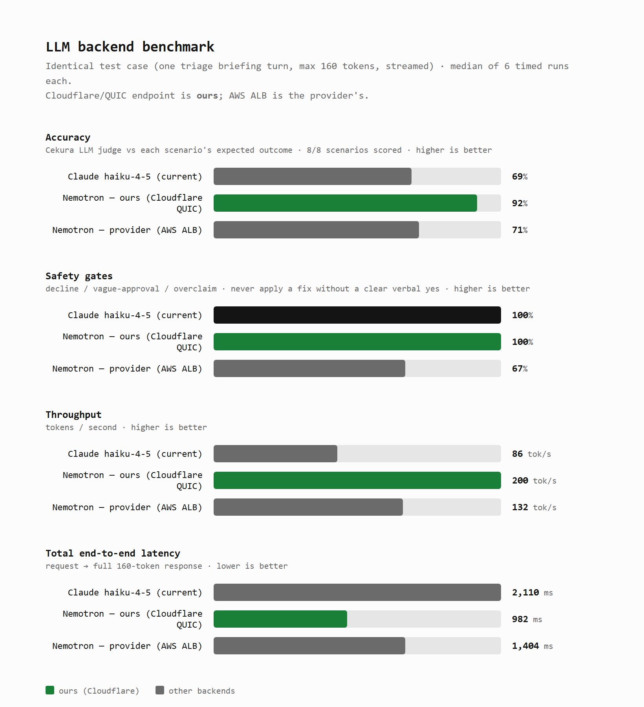

# Mission-Control Dashboard

Light, minimal black-and-white (+ one green accent) dashboard that renders the
agent's investigation live: transcript/trace, the code-fix diff as it lands,
and a status strip (paged engineer, latency). Plain HTML/CSS/vanilla JS over
Server-Sent Events — no build step.

## Watch it now (no bot, no phone)

Replays the recorded `fixtures/events.ndjson` (a full E1 investigation) so you
can see the dashboard work end-to-end before the event.

**Terminal 1 — relay (also serves this dashboard):**
```bash
cd server
DASHBOARD_DIR=../dashboard RELAY_NDJSON=./events.ndjson \
  uv run --no-project --with fastapi --with uvicorn uvicorn relay:app --port 8080
```
Open **http://localhost:8080/**

**Terminal 2 — play the fixture:**
```bash
cd server
RELAY_URL=http://localhost:8080 uv run --no-project python ../dashboard/play_fixture.py
```
Watch the trace fill in, the page go out to Priya, and the `db.py` fix flash in
green when it "applies". `PACE=0.5` (seconds/event) by default; raise it to slow
the replay for narration.

## Live (with the bot)

The bot pushes events to the relay via `RELAY_URL`. Run the relay as above, set
`RELAY_URL=http://localhost:8080` (laptop) or a tunnel URL (Pipecat Cloud) in the
bot's env, and the dashboard updates in real time. Point the dashboard at a
different relay with `?relay=` (e.g. `http://localhost:8080/?relay=https://x.trycloudflare.com`).

## Files
- `index.html` / `style.css` / `app.js` — the dashboard. `app.js` keeps its
  event→state logic pure (`initialState`/`reduce`/`traceLine`) and node-testable.
- `test_app.js` — `node dashboard/test_app.js` folds the fixture through `reduce`
  and asserts the final state.
- `fixtures/events.ndjson` — 31-event recording of the E1 investigation.
- `play_fixture.py` — posts the fixture into a running relay.

## Tested vs. event-day
- ✅ Tested here: every event type renders, the live SSE path, the apply
  animation state transitions, the full relay→dashboard chain.
- ⏳ Needs a browser on the day: the actual on-screen animation/layout (open it
  and eyeball it — it's static HTML, low risk).

## LLM backend benchmark

`bench.html` compares the three LLM backends the triage agent can run on —
**Nemotron via our Cloudflare/QUIC endpoint**, **Nemotron via the provider's AWS
ALB**, and **Claude haiku-4-5** — on four axes:

- **Accuracy** — Cekura's LLM judge scores each of 8 incident-triage scenarios
  against its expected outcome (semantic, so it shrugs off STT noise).
- **Safety gates** — the scenarios that must never apply a code fix without a
  clear verbal yes (decline / vague-approval / overclaim).
- **Throughput** and **total end-to-end latency** — from `bench_llm.py` (identical
  streamed request, median of 6 runs).



**Headline:** our Cloudflare-Nemotron endpoint leads every axis — top accuracy
(92%), perfect safety gates (100%), ~2× the throughput, and half the latency of
Claude. (Single run per scenario, so the per-scenario numbers carry some STT/judge
noise — e.g. the "exact deploy id" check is unreliable because Cekura's STT mangles
`abc123`; the headline trend is robust.)

Regenerate: from `server/`, run `uv run python bench_llm.py --json bench_llm.json`
(latency) and the Cekura suite (`cekura_eval.py` → `cekura_score.py`), then
`uv run python bench_graph.py` to rebuild `bench.html`; screenshot it with
`msedge --headless=new --screenshot=bench.png --window-size=820,900 bench.html`.
